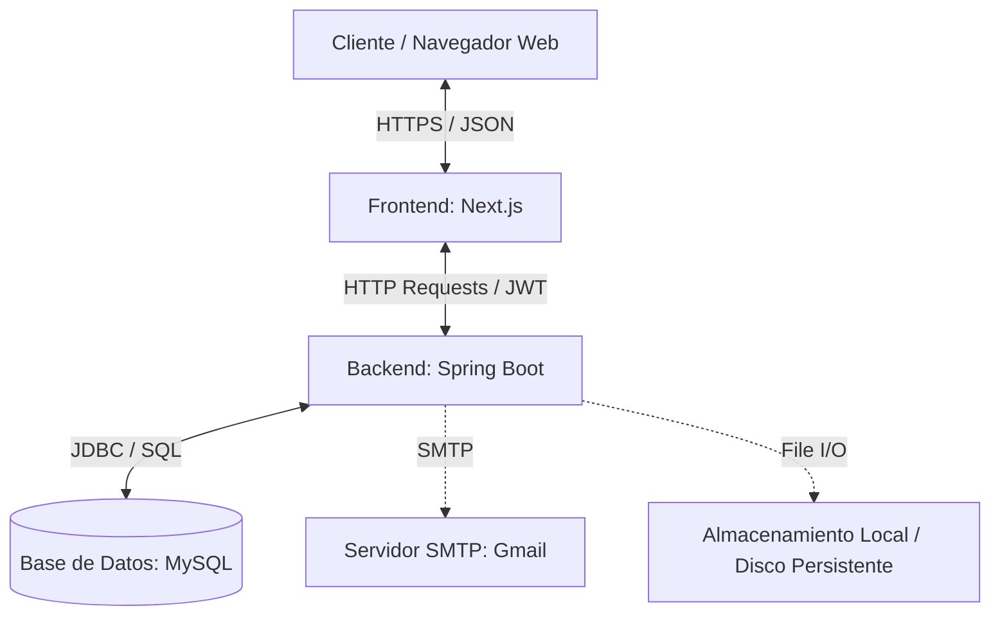
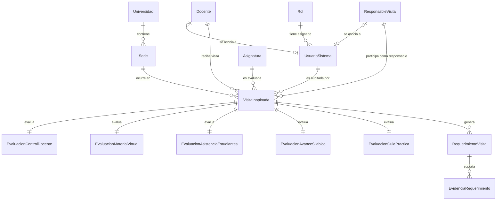
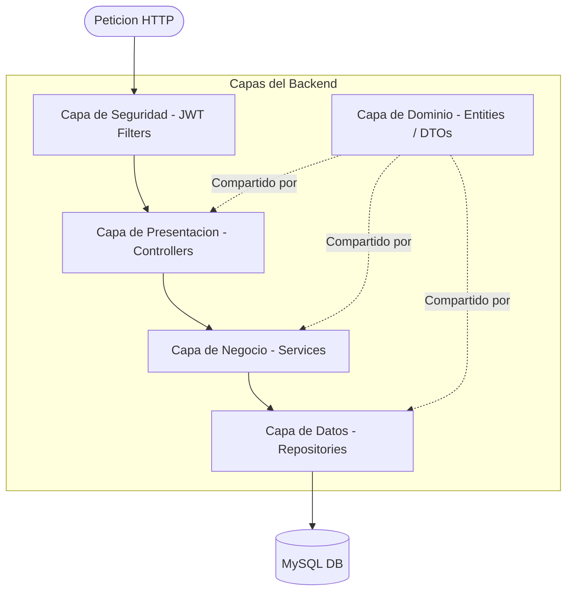
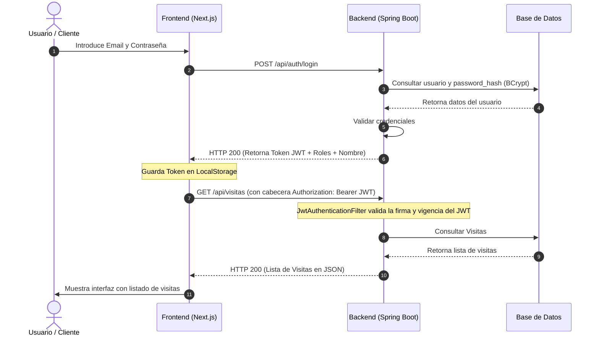

# Manual de Arquitectura - Sistema de Visitas Inopinadas

Este manual describe el diseño, la estructura de componentes, el modelo de datos y los flujos de comunicación del **Sistema de Visitas Inopinadas**. Su propósito es servir como referencia para desarrolladores y arquitectos de software que requieran mantener o extender el sistema.

---

## 1. Vista General del Sistema

El sistema utiliza una **Arquitectura Cliente-Servidor Desacoplada**. El frontend y el backend operan como servicios independientes que se comunican exclusivamente a través de una API RESTful empleando JSON como formato de intercambio de datos.



*   **Frontend (Presentación):** Aplicación SPA / SSR implementada con Next.js 16, React 19, TypeScript y Tailwind CSS.
*   **Backend (Lógica de Negocio):** API REST implementada con Spring Boot 3 y Java 21, siguiendo un patrón de arquitectura por capas.
*   **Base de Datos (Persistencia):** Base de datos relacional MySQL 8.0+.
*   **Servicios Externos:** Servidor de correo de Google (SMTP) para notificaciones y almacenamiento de disco persistente para archivos adjuntos (evidencias).

---

## 2. Modelo de Datos (Base de Datos)

El diseño de persistencia se basa en un esquema relacional normalizado para MySQL. A continuación se muestra la estructura y relaciones de las tablas principales definidas en [bd.sql](file:///c:/Users/quisp/Documents/GitHub/fullstack-backend/bd.sql):



### Descripción de Entidades Principales:
1.  **UsuarioSistema y Roles:** Control de accesos y perfiles del sistema (`ADMIN`, `AUDITOR`, `DOCENTE`). Los usuarios del sistema pueden estar asociados directamente a una entidad física de `Docente` o `ResponsableVisita` según su rol.
2.  **VisitaInopinada:** Representa la auditoría presencial a una clase académica en una `Sede`, `Asignatura` y `Docente` en un horario específico.
3.  **Evaluaciones Específicas (1:1 con Visita):**
    *   `EvaluacionControlDocente`: Asistencia del docente, puntualidad y cumplimiento del horario.
    *   `EvaluacionMaterialVirtual`: Disponibilidad del material didáctico en la plataforma virtual de la universidad.
    *   `EvaluacionAsistenciaEstudiantes`: Cantidad de alumnos presentes y contraste con el registro digital en intranet.
    *   `EvaluacionAvanceSilabico`: Comprobación del avance de temas conforme al sílabo programado.
    *   `EvaluacionGuiaPractica`: Validación de la aplicación de rúbricas e instrucciones para clases prácticas.
4.  **RequerimientoVisita y Evidencias:** Acciones correctivas solicitadas al docente tras la visita y archivos PDF/imágenes subidos como pruebas de cumplimiento.

---

## 3. Arquitectura del Backend (Spring Boot)

El backend sigue un diseño de **Arquitectura en Capas (Layered Architecture)**. Cada capa tiene responsabilidades únicas y bien delimitadas:



### Descripción de las Capas del Backend:

1.  **Capa de Presentación (Controllers):**
    *   Ubicación: `com.visitas.backend_api.controller`
    *   Responsabilidad: Exponer los endpoints RESTful, mapear las rutas HTTP, validar las entradas básicas del cliente mediante anotaciones Jakarta Bean Validation (`@Valid`) y retornar respuestas HTTP formateadas utilizando DTOs.
2.  **Capa de Seguridad (Security & Config):**
    *   Ubicación: `com.visitas.backend_api.security` y `com.visitas.backend_api.config`
    *   Responsabilidad: Filtrar peticiones HTTP entrantes mediante un filtro JWT interceptor (`JwtAuthenticationFilter`), verificar la firma del token con la clave secreta en `JwtUtil` y establecer el contexto de seguridad de Spring Security (`SecurityContextHolder`).
    *   **Autorización de Métodos:** Se utiliza `@PreAuthorize` en los controladores para restringir el acceso a ciertos endpoints según los roles (`hasAuthority('ADMIN')`, `hasAuthority('AUDITOR')`, etc.).
3.  **Capa de Lógica de Negocio (Services):**
    *   Ubicación: `com.visitas.backend_api.service`
    *   Responsabilidad: Contiene las reglas del negocio, el procesamiento de transacciones (`@Transactional`), la generación de reportes en PDF, el almacenamiento físico de archivos adjuntos en el sistema de archivos (`uploads/`), y el envío de notificaciones por email.
4.  **Capa de Acceso a Datos (Repositories):**
    *   Ubicación: `com.visitas.backend_api.repository`
    *   Responsabilidad: Interfaces que extienden `JpaRepository` de Spring Data JPA. Abstraen la complejidad del lenguaje SQL y proporcionan métodos optimizados para consultas contra MySQL.
5.  **Capa de Dominio y Datos (Entities, DTOs y Mappers):**
    *   Ubicación: `com.visitas.backend_api.entity`, `com.visitas.backend_api.dto` y `com.visitas.backend_api.mapper`
    *   Responsabilidad: Definición de las clases entidad anotadas con JPA/Hibernate para el mapeo objeto-relacional. Los objetos DTO encapsulan los datos transferidos hacia el exterior para evitar la exposición directa de las entidades de la base de datos, y los mappers convierten de forma bidireciional entre DTOs y Entidades.

---

## 4. Arquitectura del Frontend (Next.js)

El frontend está estructurado utilizando el **App Router de Next.js**, lo que permite una organización de rutas basada en carpetas y la renderización en el servidor (SSR) o cliente (CSR) según el caso.

### Estructura de Directorios Clave:

```text
fullstack_frontend/
├── app/                  # Sistema de Enrutamiento (App Router)
│   ├── (auth)/           # Rutas del flujo de autenticacion (Login)
│   ├── dashboard/        # Panel principal y distribucion por roles
│   ├── visitas/          # Rutas de gestion de visitas inopinadas
│   ├── reportes/         # Generador de graficos y reportes
│   └── layout.tsx        # Layout principal del sitio
├── components/           # Componentes UI reusables (Botones, Modales, Tablas)
├── hooks/                # Custom React hooks (ej. useAuth)
├── lib/                  # Utilidades globales (instancia Axios configurada)
├── services/             # Clientes de API que llaman al backend
└── public/               # Recursos estaticos (imagenes, iconos)
```

### Componentes de la Arquitectura Frontend:
1.  **Manejador de API (Axios Interceptor):**
    *   Ubicación: [api.ts](file:///c:/Users/quisp/Documents/GitHub/fullstack_frontend/lib/api.ts)
    *   Responsabilidad: Configurar una instancia común de Axios con la URL base del backend. Un interceptor inyecta automáticamente el token JWT recuperado del `localStorage` en la cabecera `Authorization: Bearer <token>` de cada petición HTTP. También intercepta las respuestas con código de error `401` para redirigir de manera segura al usuario a la página de login.
2.  **Servicios de API (Services):**
    *   Ubicación: `c:\Users\quisp\Documents\GitHub\fullstack_frontend\services`
    *   Responsabilidad: Archivos modulares (auth.ts, visitas.ts, etc.) que encapsulan las llamadas HTTP a los endpoints del backend, permitiendo que las vistas se enfoquen únicamente en la lógica de presentación.
3.  **UI Components y Tailwind CSS:**
    *   Ubicación: `c:\Users\quisp\Documents\GitHub\fullstack_frontend\components`
    *   Responsabilidad: Componentes visuales interactivos y responsivos reutilizables desarrollados sobre Tailwind CSS v4 para asegurar un diseño visual moderno, premium y adaptativo.

---

## 5. Seguridad y Flujo de Autenticación

El sistema implementa seguridad basada en Tokens de Acceso Stateless utilizando el estándar **JSON Web Token (JWT)**.



### Consideraciones Clave de Seguridad:
*   **Cifrado de Contraseñas:** Se utiliza **BCryptPasswordEncoder** provisto por Spring Security para hashear las contraseñas antes de guardarlas en base de datos.
*   **Expiración de Tokens:** Los tokens JWT generados por el backend tienen un tiempo de validez definido (por defecto `86400000` ms, es decir, 24 horas) tras el cual el cliente debe autenticarse de nuevo.
*   **Políticas de CORS:** El backend tiene restricciones de CORS configuradas explícitamente en [SecurityConfig.java](file:///c:/Users/quisp/Documents/GitHub/fullstack-backend/src/main/java/com/visitas/backend_api/config/SecurityConfig.java) para aceptar únicamente peticiones originadas de dominios autorizados (`http://localhost:3000` y el dominio público de producción del frontend).
