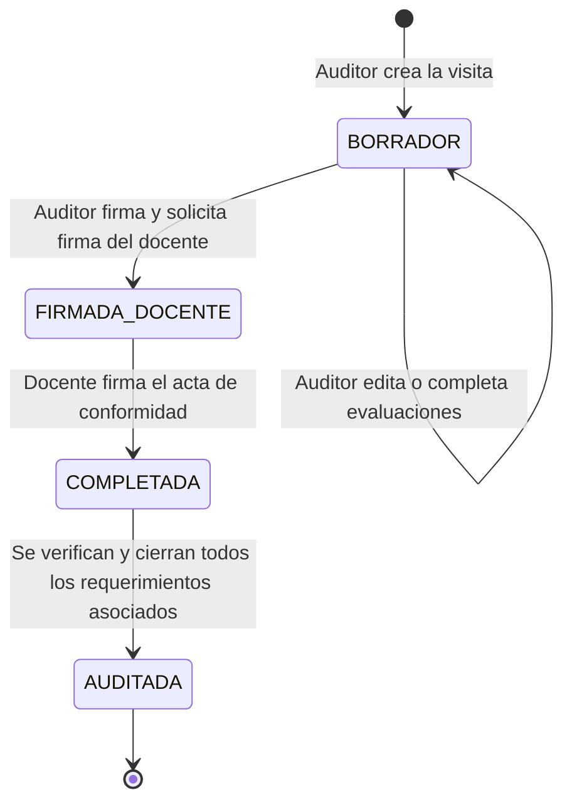

# Manual de Usuario - Sistema de Visitas Inopinadas

Este manual está diseñado para orientar a los usuarios del **Sistema de Visitas Inopinadas** en el uso diario de la plataforma. El sistema permite registrar, auditar y dar seguimiento a las auditorías presenciales realizadas a las aulas universitarias, garantizando la calidad educativa.

---

## 1. Perfiles de Usuario y Matriz de Permisos

El sistema cuenta con tres perfiles principales de usuario. Cada perfil dispone de menús y acciones específicas en la plataforma:

| Módulo / Acción | Administrador (ADMIN) | Auditor / Visitador (AUDITOR) | Docente (DOCENTE) |
| :--- | :---: | :---: | :---: |
| **Dashboard y Estadísticas** | Completo (General) | Parcial (Visitas) | Solo propias |
| **Creación/Programación de Visitas**| ❌ | ✔️ | ❌ |
| **Llenar Fichas de Evaluación** | ❌ | ✔️ | ❌ |
| **Generar Requerimientos** | ❌ | ✔️ | ❌ |
| **Firmar Acta de Visita** | ❌ | ✔️ | ✔️ (Firma del Docente) |
| **Subir Evidencias de Requerimientos**| ❌ | ❌ | ✔️ |
| **Gestión de Catálogos (Sedes, Asignaturas)** | ✔️ | ❌ | ❌ |
| **Gestión de Usuarios y Docentes**| ✔️ | ❌ | ❌ |
| **Configuración Institucional** | ✔️ | ❌ | ❌ |

---

## 2. Acceso al Sistema y Perfil

### A. Inicio de Sesión (Login)
1.  Ingresa a la URL del portal del sistema.
2.  Introduce tu correo electrónico institucional y tu contraseña.
3.  Haz clic en **Iniciar Sesión**.
4.  Si las credenciales son correctas, el sistema te redirigirá a tu panel principal (Dashboard) correspondiente a tu rol.

### B. Gestión del Perfil y Firma Digital
Para registrar tu firma electrónica (necesaria para firmar actas de visita):
1.  Dirígete a la sección **Mi Perfil** (en el menú lateral).
2.  Verás tus datos personales (Nombres, Apellidos, Correo, Rol).
3.  En la sección de **Firma Digital**, puedes configurar tu *Hash de Firma* o PIN de verificación.
4.  Guarda los cambios. Esta firma se aplicará de forma electrónica para validar las actas de visitas.

---

## 3. Módulo 1: Guía para Administradores

El Administrador tiene el control total sobre la configuración global y catálogos de la plataforma.

### A. Gestión de Usuarios
Permite habilitar cuentas y asignar roles al personal de la universidad.
1.  Ve a **Usuarios** en el menú lateral.
2.  Para crear un usuario: Haz clic en **Nuevo Usuario**, completa los nombres, apellidos, correo, contraseña y selecciona el rol (`ADMIN`, `AUDITOR`, o `DOCENTE`). Si es auditor o docente, asócialo con su ficha de personal correspondiente.
3.  Para deshabilitar a un usuario: Busca al usuario en la tabla y haz clic en el botón de estado para cambiarlo a **Inactivo**.

### B. Mantenimiento de Catálogos
Para que los auditores puedan programar visitas, el administrador debe mantener actualizados los catálogos en los siguientes menús:
*   **Sedes:** Sedes físicas de la universidad (Ej: Sede Central, Sede Norte, etc.).
*   **Docentes:** Ficha de datos de los docentes contratados.
*   **Asignaturas:** Cursos activos con información del ciclo académico, turno y tipo de horario (Teórico/Práctico).
*   **Responsables:** Personal encargado de guiar o autorizar las auditorías en las aulas.

### C. Configuración Institucional
1.  Ve a **Configuración** en el menú lateral.
2.  Configura el nombre de la Universidad, Facultad, Vicerrectorado y Escuela Profesional.
3.  Define el **Código del Formulario** (Ej: `VRA-FR-040`) y la versión de calidad vigente para que aparezcan automáticamente en las cabeceras de los PDFs generados.

---

## 4. Módulo 2: Guía para Auditores (Realización de Visitas)

El Auditor es el encargado de acudir a las aulas y registrar el cumplimiento de los estándares educativos.

### A. Programar o Crear una Nueva Visita
1.  Ve a **Visitas** y haz clic en **Nueva Visita**.
2.  Selecciona la fecha, hora de inicio y fin, el aula o lugar, la sede, el docente, la asignatura y el responsable de la visita.
3.  Haz clic en **Guardar**. La visita se creará en estado de **Borrador**.

### B. Completar la Ficha de Evaluación (Checklist)
Una vez en el aula, ingresa a la visita programada y completa las 5 secciones de evaluación obligatorias:
1.  **Control Docente:** Marca si el docente está presente y si cumple con el horario. Describe la actividad que se está desarrollando.
2.  **Material Virtual:** Verifica en la plataforma digital si los materiales de la sesión fueron subidos con la debida anticipación.
3.  **Asistencia Estudiantes:** Registra el número de alumnos presentes y si la asistencia fue marcada en intranet en los primeros minutos.
4.  **Avance Silábico:** Revisa si el tema dictado coincide con el tema programado en el sílabo.
5.  **Guía Práctica:** Para clases mixtas o prácticas, verifica si se usa una guía estructurada y rúbricas.

### C. Generar Requerimientos (Acciones Correctivas)
Si durante la evaluación marcas algún incumplimiento (por ejemplo, el docente no subió el material virtual o no coincide el sílabo):
1.  En la misma pantalla de la visita, ve a la sección **Requerimientos**.
2.  Haz clic en **Agregar Requerimiento**.
3.  Describe de forma clara la acción correctiva que el docente debe realizar (Ej: "Subir la guía de práctica N° 5 en el aula virtual").
4.  Guarda el requerimiento. Quedará en estado **Pendiente**.

### D. Firma y Cierre de la Visita
1.  Revisa que todos los datos de la evaluación sean correctos.
2.  Al final de la pantalla, el Auditor debe presionar el botón **Firmar como Auditor** (aplicará su Hash de Firma).
3.  La visita cambiará a estado **FIRMADA_DOCENTE** o **COMPLETADA** según las firmas aplicadas.
4.  Puedes descargar el PDF oficial del acta firmada haciendo clic en el botón de **Descargar Reporte / PDF**.

---

## 5. Módulo 3: Guía para Docentes

El Docente interactúa con el sistema para revisar las visitas aplicadas a sus aulas, firmar de conformidad y subsanar observaciones.

### A. Revisión de Visitas Recibidas
1.  Al entrar al sistema, el Dashboard te mostrará un listado de las visitas inopinadas aplicadas a tus clases.
2.  Haz clic en una visita para ver el detalle de los puntos evaluados por el auditor (asistencia, sílabo, material virtual) y las observaciones.

### B. Firmar Conformidad de la Visita
1.  Una vez revisados los datos de la evaluación en la pantalla de detalle de la visita, dirígete al botón **Firmar como Docente**.
2.  Introduce tu firma electrónica (Hash de firma configurado en tu perfil) para dar conformidad.
3.  El acta quedará firmada digitalmente por ambas partes.

### C. Resolver Requerimientos (Subir Evidencias)
Si el auditor te dejó requerimientos en estado **Pendiente**:
1.  Ve al menú **Requerimientos**.
2.  Verás la lista de tareas pendientes de subsanar. Haz clic en **Subir Evidencia** sobre la tarea correspondiente.
3.  Escribe una breve descripción del descargo.
4.  Selecciona y adjunta el archivo de prueba (PDF o imagen de captura de pantalla).
5.  Haz clic en **Enviar Evidencia**.
6.  El requerimiento cambiará a estado **ATENDIDO**, indicándole al auditor que has cumplido con la corrección.

---

## 6. Flujo de Estados de una Visita Inopinada

A continuación se ilustra el ciclo de vida de un registro de visita en la plataforma:

